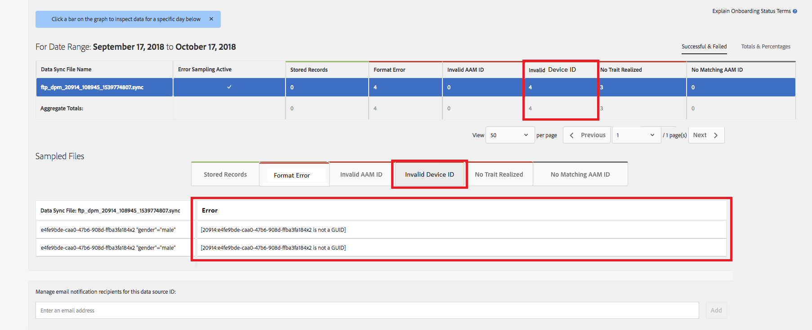

# Validação de ID de dispositivo global {#global-device-id-validation}

Os Identificadores de publicidade de dispositivos (ou seja, iDFA, GAID, ID Roku) têm padrões de formatação que devem ser atendidos para serem usados no ecossistema de publicidade digital. Hoje, clientes e parceiros podem fazer upload de IDs para nossas fontes de dados globais em qualquer formato sem serem notificados sobre se a ID está formatada corretamente. Esse recurso introduzirá a validação de IDs de dispositivo enviadas às fontes de dados Globais para formatação adequada e fornecerá mensagens de erro quando as IDs estiverem formatadas incorretamente. Oferecemos suporte à validação para [!DNL iDFA], [!DNL Google Advertising] e [!DNL Roku IDs] no lançamento.

## Visão geral dos padrões de formato {#overview-of-format-standards}

A seguir estão os pools globais de IDs de publicidade de dispositivos reconhecidos e suportados atualmente pelo AAM. Eles são implementados como compartilhados [!UICONTROL Data Sources] que podem ser usados por qualquer cliente ou parceiro de dados que trabalhe com dados vinculados aos usuários dessas plataformas.

<table>
  <tr>
   <td>Plataforma </td>
   <td>ID da fonte de dados AAM </td>
   <td>Formato de ID </td>
   <td>PID AAM </td>
   <td>Notas </td>
  </tr>
  <tr>
   <td>Google Android (GAID)</td>
   <td>20914</td>
   <td>32 números hex, geralmente apresentados como 8-4-4-4-12<em>exemplo, 97987bca-ae59-4c7d-94ba-ee4f19ab8c21  </em> </td>
   <td>1352</td>
   <td>Essa ID deve ser coletada em uma forma bruta/sem hash/inalterada Referência - <a href="https://play.google.com/about/monetization-ads/ads/ad-id/">https://play.google.com/about/monetization-ads/ads/ad-id/</a></td>
  </tr>
  <tr>
   <td>Apple iOS (IDFA)</td>
   <td>20915</td>
   <td>32 números hex, geralmente apresentados como 8-4-4-4-12 <em>exemplo, 6D92078A-8246-4BA4-AE5B-76104861E7DC  </em> </td>
   <td>3560</td>
   <td>Essa ID deve ser coletada em uma forma bruta/sem hash/inalterada Referência - <a href="https://support.apple.com/en-us/HT205223">https://support.apple.com/en-us/HT205223</a></td>
  </tr>
  <tr>
   <td>Roku (RIDA)</td>
   <td>121963</td>
   <td>32 números hex, geralmente apresentados como 8-4-4-4-12 <em>exemplo,</em> <em>fcb2a29c-315a-5e6b-bcfd-d889ba19aada</em></td>
   <td>11536</td>
   <td>Essa ID deve ser coletada em uma forma bruta/sem hash/inalterada Referência - <a href="https://sdkdocs.roku.com/display/sdkdoc/Roku+Advertising+Framework">https://sdkdocs.roku.com/display/sdkdoc/Roku+Advertising+Framework</a> </td>
  </tr>
  <tr>
   <td>ID de publicidade da Microsoft (MAID)</td>
   <td>389146</td>
   <td>String alfanumérica</td>
   <td>14593</td>
   <td>Essa ID deve ser coletada em uma forma bruta/sem hash/inalterada Referência - <a href="https://docs.microsoft.com/en-us/uwp/api/windows.system.userprofile.advertisingmanager.advertisingid">https://docs.microsoft.com/en-us/uwp/api/windows.system.userprofile.advertisingmanager.advertisingid</a> <a href="https://msdn.microsoft.com/en-us/library/windows/apps/windows.system.userprofile.advertisingmanager.advertisingid.aspx">https://msdn.microsoft.com/en-us/library/windows/apps/windows.system.userprofile.advertisingmanager.advertisingid.aspx</a></td>
  </tr>
  <tr>
   <td>Samsung DUID</td>
   <td>404660</td>
   <td>Exemplo de string alfanumérica, 7XCBNROQJQPYW</td>
   <td>15950</td>
   <td>Essa ID deve ser coletada em uma forma bruta/sem hash/inalterada Referência - <a href="https://developer.samsung.com/tv/develop/api-references/samsung-product-api-references/productinfo-api">https://developer.samsung.com/tv/develop/api-references/samsung-product-api-references/productinfo-api</a> </td>
  </tr>
</table>

## Definir um identificador de anúncio no aplicativo {#setting-an-advertising-identifier-in-the-app}

Na verdade, definir a ID do anunciante no aplicativo é um processo de duas etapas: primeiro, recuperar a ID do anunciante e, em seguida, enviá-la para o Experience Cloud. Os links são encontrados abaixo para executar essas etapas.

1. Recuperar a ID
   1. [!DNL Apple] informações sobre o [!DNL advertising ID] pode ser encontrado [AQUI](https://developer.apple.com/documentation/adsupport/asidentifiermanager).
   1. Algumas informações sobre a configuração do [!DNL advertiser ID] para [!DNL Android] desenvolvedores podem ser encontrados [AQUI](http://android.cn-mirrors.com/google/play-services/id.html).
1. Envie-o para o Experience Cloud usando o [!DNL setAdvertisingIdentifier] no SDK
   1. Informações para usar o `setAdvertisingIdentifier` está na [documentação](https://aep-sdks.gitbook.io/docs/using-mobile-extensions/mobile-core/identity/identity-api-reference#set-an-advertising-identifier) para ambos [!DNL iOS] e [!DNL Android].

`// iOS (Swift) example for using setAdvertisingIdentifier:`
`ACPCore.setAdvertisingIdentifier([AdvertisingId]) // ...where [AdvertisingId] is replaced by the actual advertising ID`

## Mensagens de erro DCS para IDs incorretas  {#dcs-error-messaging-for-incorrect-ids}

Quando uma ID de dispositivo global incorreta (IDFA, GAID etc.) é enviada em tempo real para o Audience Manager, um código de erro é retornado na ocorrência. Veja a seguir um exemplo de um erro retornado porque a ID é enviada como uma [!DNL Apple IDFA], que deve conter apenas letras maiúsculas e, no entanto, há um &quot;x&quot; minúsculo na ID.

Consulte a [documentação](https://experienceleague.adobe.com/docs/audience-manager/user-guide/api-and-sdk-code/dcs/dcs-api-reference/dcs-error-codes.html?lang=en#api-and-sdk-code) para obter a lista de códigos de erro.

## IDs de dispositivo global integradas {#onboarding-global-device-ids}

Além do envio em tempo real de IDs de dispositivos globais, você também pode &quot;[!DNL onboard]&quot; (upload) dados nas IDs também. Esse processo é o mesmo de quando você está integrando dados nas IDs do cliente (normalmente por meio de pares de chave/valor), mas você simplesmente usaria as IDs da fonte de dados apropriadas, para que os dados sejam atribuídos à ID do dispositivo global. A documentação sobre o processo de integração pode ser encontrada no [documentação](https://experienceleague.adobe.com/docs/audience-manager/user-guide/implementation-integration-guides/sending-audience-data/batch-data-transfer-process/batch-data-transfer-overview.html?lang=en#implementation-integration-guides). Lembre-se de usar a ID da fonte de dados global, dependendo da plataforma que você está usando.

Se IDs de dispositivo global incorretas forem enviadas por meio do processo de integração, os erros serão exibidos no [[!DNL Onboarding Status Report]](https://experienceleague.adobe.com/docs/audience-manager/user-guide/reporting/onboarding-status-report.html?lang=en#reporting).

Veja a seguir um exemplo de erro que apareceria nesse relatório:

