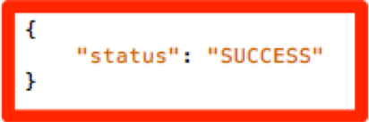

# Migrando a implementação de AAM do seu site de [!DNL Client-Side] DIL para [!DNL Server-Side Forwarding] {#migrating-your-site-s-aam-implementation-from-client-side-dil-to-server-side-forwarding}

Este tutorial se aplica a você se tiver o Adobe Audience Manager (AAM) e o Adobe Analytics, e estiver enviando uma ocorrência da página para AAM usando o código &quot;DIL&quot; ([!DNL Data Integration Library]) e também enviando uma ocorrência da página para o Adobe Analytics. Como você tem ambas as soluções, e como elas são parte da Adobe Experience Cloud, você tem a oportunidade de seguir a prática recomendada de ativar o &quot;[!DNL Server-Side Forwarding] (SSF)&quot;, que permite que os servidores de coleta de dados [!DNL Analytics] encaminhem os dados de análise do site em tempo real para o Audience Manager, em vez de ter o código [!DNL client-side] envie uma ocorrência adicional da página para o AAM. Este tutorial o guiará pelas etapas da mudança da implementação mais antiga &quot;[!DNL Client-Side DIL]&quot; para o método mais recente &quot;[!DNL Server-Side forwarding]&quot;.

## [!DNL Client-Side] (DIL) vs.  [!DNL Server-Side] {#client-side-dil-vs-server-side}

Ao comparar e contrastar esses dois métodos de colocar os dados do Adobe Analytics em AAM, pode ser útil primeiro visualizar as diferenças na imagem a seguir:

### [!DNL Client-side] Implementação de DIL  {#client-side-dil-implementation}

Se estiver usando esse método para obter dados do Adobe Analytics no AAM, significa que você tem duas ocorrências provenientes de suas páginas da Web: Um indo para [!DNL Analytics], e outro indo para AAM (após ter copiado os dados [!DNL Analytics] na página da Web. [!UICONTROL Segments] são retornadas de AAM para a página, onde podem ser usadas para personalização, etc. Essa é uma implementação &quot;herdada&quot; e não é mais recomendada.

Além do fato de que isso não está seguindo as práticas recomendadas, as desvantagens de usar esse método incluem:

* Duas ocorrências vêm da página, em vez de apenas uma
* [!UICONTROL Server-Side Forwarding] é necessário para o compartilhamento em tempo real de públicos-alvo AAM para o  [!DNL Analytics], de modo que  [!DNL Client-side] as implementações não permitem esse recurso (e possivelmente outros recursos no futuro)

Recomenda-se mudar para um método [!UICONTROL Server-Side Forwarding] de implementação AAM.

### [!UICONTROL Server-Side Forwarding] Implementação {#server-side-forwarding-implementation}

Como mostrado na imagem acima, uma ocorrência vem da página da Web para o Adobe Analytics. [!DNL Analytics] em seguida, encaminha esses dados para AAM em tempo real, e os visitantes são avaliados em AAM  [!UICONTROL traits] e  [!UICONTROL segments], como se a ocorrência tivesse vindo diretamente da página.

[!UICONTROL Segments] são retornados na mesma ocorrência em tempo real para  [!DNL Analytics], o que encaminha a resposta na página da Web para personalização etc.

Não há tempo para mudar para o encaminhamento pelo lado do servidor. Recomendamos que qualquer pessoa que tenha Audience Manager e [!DNL Analytics] utilize esse método de implementação.

## Existem DUAS Tarefas Principais {#you-have-two-main-tasks}

Há bastante informação nesta página, e é tudo importante, é claro. No entanto, **tudo se resume a duas coisas principais que você precisa fazer**:

1. Altere seu código de [!DNL Client-Side] DIL code para [!UICONTROL Server-Side Forwarding] code
1. Inverta o switch no [!DNL Analytics] [!DNL Admin Console] para iniciar o encaminhamento real de dados (de acordo com [!UICONTROL report suite])

Se você ignorar qualquer um desses dois, o SSF não funcionará corretamente. As etapas e dados adicionais foram adicionados a este documento para ajudar você a executar essas duas etapas corretamente para sua configuração.

## Opções de implementação {#implementation-options}

À medida que você muda de [!DNL client-side] para [!DNL server-side], uma das tarefas que terá é alterar o código para o novo código [!UICONTROL Server-Side Forwarding]. Isso é feito usando uma das seguintes opções:

* Adobe Experience Platform Launch - Nossa opção de implementação recomendada para propriedades da Web. Você verá que esta é uma tarefa muito fácil, pois [!DNL Launch] fez tudo o que era difícil para você.
* Na página - Você também pode colocar o novo código SSF diretamente na função `doPlugins` dentro do arquivo [!DNL appMeasurement.js], se não estiver (ainda) usando o Adobe Launch
* Outros gerenciadores de tags - Eles podem ser tratados da mesma forma que a opção anterior (Na página), já que você ainda colocará o código SSF em `doPlugins`, onde quer que o outro gerenciador de tags esteja armazenando o código [!DNL AppMeasurement]

Analisaremos cada um desses itens abaixo na seção Atualização do código .

## Etapas da implementação {#implementation-steps}

### Etapa 0: Pré-requisito: Serviço de Experience Cloud ID (ECID) {#step-prerequisite-experience-cloud-id-service-ecid}

O pré-requisito principal para migrar para [!UICONTROL Server-Side Forwarding] é ter o Serviço de ID do Experience Cloud implementado. Isso é feito com mais facilidade se estiver usando o Experience Platform Launch, nesse caso, basta instalar a extensão ECID e ele fará o resto.

Se você estiver usando um TMS que não seja do Adobe ou nenhum TMS, implemente o ECID para executar **antes de** qualquer outra solução do Adobe. Consulte a [documentação da ECID](https://marketing.adobe.com/resources/help/pt_BR/mcvid/) para obter mais detalhes. O único outro pré-requisito é relacionado às versões de código, de modo que você simplesmente aplique as versões mais recentes do código nas etapas a seguir, tudo ficará bem.

>[!NOTE]
>
>Leia este documento inteiro antes de implementar. A seção &quot;Tempo&quot; abaixo tem informações importantes sobre *quando* você deve implementar cada parte, incluindo ECID (se ainda não estiver implementada).

### Etapa 1: Registrar opções atualmente usadas no código DIL {#step-record-currently-used-options-from-dil-code}

À medida que você se prepara para migrar do [!DNL Client-Side] DIL para [!UICONTROL Server-Side Forwarding], a primeira etapa é identificar tudo o que você está fazendo com o DIL code, incluindo configurações personalizadas e dados enviados para o AAM. As coisas a serem notadas e consideradas incluem:

* Variáveis normais [!DNL Analytics], usando o módulo de DIL [!DNL siteCatalyst.init] - Você não precisará se preocupar com essa, pois seu trabalho é apenas enviar as variáveis normais [!DNL Analytics] para cima, e isso acontecerá em virtude de simplesmente ter o SSF ativado.
* Subdomínio do parceiro - Na função DIL.create , anote o parâmetro `partner` . Isso é conhecido como &quot;subdomínio do parceiro&quot; ou, às vezes, &quot;ID do parceiro&quot; e será necessário ao colocar o novo código SSF.
* [!DNL Visitor Service Namespace] - Também conhecido como &quot;[!DNL Org ID]&quot; ou &quot;[!DNL IMS Org ID],&quot; você também precisará disso ao configurar o novo código SSF. Tome nota disso.
* containerNSID, uuidCookie e outras opções avançadas - Anote todas as opções avançadas adicionais que estiver usando para que você possa defini-las no código SSF também.
* Variáveis de página adicionais - Se outras variáveis estiverem sendo enviadas para o AAM a partir da página (além das variáveis [!DNL Analytics] normais manipuladas pelo siteCatalyst.init), você precisará tomar nota delas para que possam ser enviadas pelo SSF (alerta de spoiler: por meio de variáveis [!DNL contextData]).

### Etapa 2: Atualização do código {#step-updating-the-code}

Na seção acima intitulada &quot;Opções de implementação&quot;, várias opções são fornecidas em relação a como/onde você está implementando [!UICONTROL Server-Side Forwarding]. Para que esta seção seja eficaz, precisamos dividi-la nestas seções (com duas delas combinadas). Vá para o método desta seção que descreve melhor suas necessidades.

#### Adobe Experience Platform Launch {#launch-by-adobe}

Assista ao vídeo abaixo para saber mais sobre como mover as opções de implementação do [!DNL Client-Side] DIL code para [!UICONTROL Server-Side Forwarding] no Experience Platform Launch.

>[!VIDEO](https://video.tv.adobe.com/v/26310/?quality=12)

#### &quot;Na página&quot; ou não Adobe Tag Manager {#on-the-page-or-non-adobe-tag-manager}

Assista ao vídeo abaixo para saber mais sobre como mover as opções de implementação do [!DNL Client-Side] DIL code para [!UICONTROL Server-Side Forwarding] no código [!DNL AppMeasurement], residindo em um arquivo ou em um sistema de gerenciamento de tags que não seja o Adobe.

>[!VIDEO](https://video.tv.adobe.com/v/26312/?quality=12)

### Etapa 3: Ativar o encaminhamento (de acordo com [!UICONTROL Report Suite]) {#step-enabling-the-forwarding-per-report-suite}

Até agora neste tutorial, gastamos todo o nosso tempo alternando o código do [!DNL Client-Side DIL] código para [!UICONTROL Server-Side Forwarding]. Tudo bem, porque é a parte mais difícil. Esta seção, embora você veja que é super fácil, é tão importante quanto atualizar o código. Neste vídeo, você verá como virar o switch que permite o encaminhamento real de dados do Analytics para o Audience Manager.

>[!VIDEO](https://video.tv.adobe.com/v/26355/?quality-12)

**NOTA:** conforme declarado no vídeo, lembre-se de que a ativação do encaminhamento levará até 4 horas para ser totalmente implementada no back-end do Experience Cloud.

## Tempo {#timing}

Como lembrete, há duas tarefas principais para mudar de [!DNL Client-Side DIL] para [!UICONTROL Server-Side Forwarding]:

1. Atualização do código
1. Deslizando o switch no [!DNL Analytics] [!DNL Admin Console]

Mas a questão é, qual delas você faz primeiro? Isso importa? OK, desculpe, isso foram duas perguntas. Mas as respostas são... depende, e sim, isso *pode* importar. Como isso é vago? Vamos dividir. Mas primeiro uma pergunta adicional que pode surgir se você for uma grande organização com muitos sites: Eu tenho que fazer tudo de uma vez? Esse é um pouco mais fácil. Não. Pode-se fazer isso, peça a peça... tipo. :)

### Um pouco mais profundo {#a-little-deeper-dive}

O motivo pelo qual o tempo e a ordem são importantes é por causa de como o encaminhamento *realmente *funciona, que pode ser resumido nos seguintes fatos técnicos:

* Se o Serviço de ID de Experience Cloud (ECID) estiver implementado e o switch no [!DNL Analytics] [!DNL Admin Console] (&quot;o switch&quot;) estiver ativado, os dados serão encaminhados do [!DNL Analytics] para o AAM, mesmo que você ainda não tenha atualizado o código.
* Se você não tiver o ECID implementado, os dados não serão encaminhados, mesmo que você tenha a chave ligada, e terá o código SSF.
* O código SSF (seja em [!DNL Launch] ou na página) realmente lida com a resposta e é, claro, necessário para concluir a migração.
* Lembre-se de que o switch SSF é habilitado por [!UICONTROL Report Suite], mas que o código é manipulado pela propriedade em [!DNL Launch] ou por [!DNL AppMeasurement] arquivo, se você não usar [!DNL Launch]

### Práticas recomendadas {#best-practices}

Com base nesses detalhes técnicos, aqui estão as recomendações para o tempo de &quot;o que fazer quando&quot;:

#### Se você NÃO tiver a ECID implementada {#if-you-do-not-have-ecid-yet-implemented}

1. Inverta o switch em [!DNL Analytics] para cada [!UICONTROL report suite] que você ativará para SSF

   1. O encaminhamento ainda não será iniciado porque você não tem ECID

1. Por site, atualize seu código de [!DNL Client-Side DIL] para SSF (isso pode estar em [!DNL Launch] ou na página, conforme discutido em outra seção acima)

   1. O encaminhamento agora fluirá (conforme você adicionou o ECID) e também deverá receber uma resposta JSON adequada ao beacon [!DNL Analytics] (consulte a seção Validação e solução de problemas abaixo para obter mais detalhes)

#### Se você tiver a ECID implementada {#if-you-do-have-ecid-implemented}

1. Prepare e planeje de forma que esteja pronto para atualizar seu código do DIL para SSF PER [!UICONTROL report suite] para que você habilite para SSF:

   1. Inverta o switch em [!DNL Analytics] para ativar o SSF

      1. O encaminhamento será iniciado porque a ECID está habilitada
   1. Assim que possível, atualize seu código de [!DNL Client-Side DIL] para SSF (isso pode estar em [!DNL Launch] ou na página, conforme discutido em outra seção acima)

      1. Você deve receber uma resposta JSON adequada ao beacon [!DNL Analytics] (consulte a seção Validação e solução de problemas abaixo para obter mais detalhes)

**NOTA 1:** É importante fazer essas duas etapas o mais próximo possível uma da outra, pois entre as etapas 1 e 2 acima, você terá duplicação de dados entrando em AAM. Em outras palavras, o SSF começará a enviar dados de [!DNL Analytics] para o AAM e, como o código DIL ainda está na página, também haverá uma ocorrência indo diretamente da página para o AAM, dobrando os dados. Assim que você atualizar o código do DIL para SSF, isso será atenuado.

**NOTA 2:** se preferir ter uma pequena discrepância nos dados em vez de uma pequena duplicação de dados, você pode alterar a ordem das etapas 1 e 2 acima. Mover o código do DIL para o SSF interromperia o fluxo de dados para o AAM até que você pudesse virar o switch para ativar o SSF para o [!UICONTROL report suite]. Normalmente, os clientes preferem ter uma pequena duplicação de dados em vez de deixar de colocar os visitantes em [!UICONTROL traits] e [!UICONTROL segments].

#### Tempo de migração quando você tem muitos sites e [!UICONTROL Report Suites] {#migration-timing-when-you-have-many-sites-and-report-suites}

Este tópico é brevemente abordado em seções anteriores, na medida em que a estratégia principal pode ser resumida pelo seguinte:

Migre um site/[!UICONTROL report suite] (ou grupo de sites/[!UICONTROL report suites]) de cada vez.

No entanto, isso pode se tornar um pouco complicado com base em alguns cenários possíveis:

* Você tem um site que contém vários [!UICONTROL report suites] distintos
* Você tem um [!UICONTROL report suite] que inclui vários sites (como um [!UICONTROL report suite] global)
* Você usa uma propriedade [!DNL Launch] para abranger vários sites
* Você tem diferentes equipes de desenvolvimento para sites diferentes

Por causa desses itens, pode ficar um pouco complicado. As melhores coisas que posso sugerir são:

* Reserve algum tempo para fazer uma estratégia de migração para SSF, com base nas informações explicadas acima
* Com base no fato de que uma única propriedade em [!DNL Launch] (ou um único arquivo [!DNL AppMeasurement]) normalmente mapeia para 1 ou 2 [!UICONTROL report suites] distintas, você provavelmente poderá fazer um plano que funcione nesses grupos distintos um por um, atualizando sua empresa para SSF
* Se você estiver trabalhando com a Adobe Consulting, fale com eles sobre seu plano de migração para que eles possam ajudar conforme necessário

## Validação e solução de problemas {#validation-and-troubleshooting}

A maneira principal de validar que o [!UICONTROL Server-Side Forwarding] está em execução é observar a resposta a qualquer uma das ocorrências do Adobe Analytics que vêm do aplicativo.

Se você não estiver fazendo [!UICONTROL server-side forwarding] de dados de [!DNL Analytics] para o Audience Manager, então não há resposta para o sinal [!DNL Analytics] (fora um pixel com dimensões 2x2). No entanto, se estiver fazendo SSF, há itens que você pode verificar na solicitação e resposta [!DNL Analytics] que informam que [!DNL Analytics] está se comunicando corretamente com o Audience Manager, encaminhando a ocorrência e obtendo uma resposta.

>[!VIDEO](https://video.tv.adobe.com/v/26359/?quality=12)

**AVISO:** Cuidado com o falso &quot;sucesso&quot; - Se houver uma resposta e tudo parecer estar funcionando, verifique se você tem o objeto &quot;stuff&quot; na resposta. Caso contrário, você poderá ver uma mensagem que diz [!DNL "status":"SUCCESS"]. Por mais louco que isso pareça, isso é prova de que NÃO está funcionando corretamente. Caso veja isso, significa que você concluiu a atualização do código em [!DNL Launch] ou [!DNL AppMeasurement], mas que o encaminhamento no [!DNL Analytics] [!DNL Admin Console] ainda não foi concluído. Nesse caso, você precisa verificar se ativou o SSF no [!DNL Analytics] [!DNL Admin Console] para seu [!UICONTROL report suite]. Se você tiver, e ainda não tiver passado quatro horas, seja paciente, pois pode levar tanto tempo para fazer todas as alterações necessárias no back-end.

Para obter mais informações sobre [!UICONTROL Server-Side Forwarding], consulte a [documentação](https://marketing.adobe.com/resources/help/en_US/reference/ssf.html).
