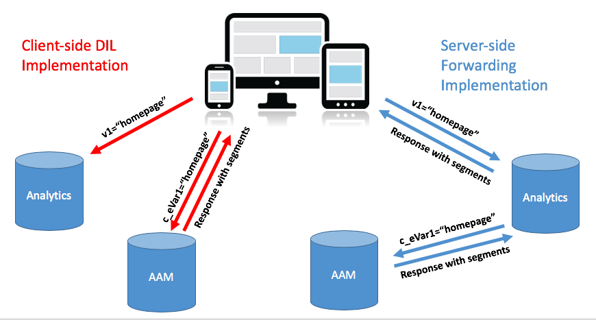

# Migrar a implementação do Audience Manager de seu site do DIL do lado do cliente para o encaminhamento do lado do servidor {#migrating-your-site-s-aam-implementation-from-client-side-dil-to-server-side-forwarding}

Este tutorial se aplica a você se tiver o Adobe Audience Manager (AAM) e o Adobe Analytics e estiver enviando uma ocorrência da página para o AAM usando o DIL ([!DNL Data Integration Library]) e também enviar uma ocorrência da página para o Adobe Analytics. Como você tem ambas as soluções, e como elas são parte da Adobe Experience Cloud, você tem a oportunidade de seguir a prática recomendada de ativar o encaminhamento pelo lado do servidor, o que permite que o [!DNL Analytics] servidores de coleta de dados para encaminhar os dados analíticos do site em tempo real para o Audience Manager, em vez de fazer com que o código do lado do cliente envie uma ocorrência adicional da página para o AAM. Este tutorial o orienta pelas etapas da transição da implementação de DIL do lado do cliente mais antiga para o método de encaminhamento do lado do servidor mais recente.

## Lado do cliente (DIL) vs. lado do servidor {#client-side-dil-vs-server-side}

Ao comparar e contrastar esses dois métodos de colocar os dados do Adobe Analytics em AAM, pode ser útil primeiro visualizar as diferenças na imagem a seguir:

### Implementação do DIL do lado do cliente {#client-side-dil-implementation}

Se usar esse método para obter dados do Adobe Analytics no AAM, você terá duas ocorrências provenientes de suas páginas da Web: Um vai para [!DNL Analytics], e uma AAM (após ter copiado a variável [!DNL Analytics] na página da Web. [!UICONTROL Segments] são retornados do AAM para a página, onde podem ser usados para personalização e assim por diante. Isso é considerado uma implementação legada e não é mais recomendada.

Além do fato de que isso não está seguindo as práticas recomendadas, as desvantagens de usar esse método incluem:

* Duas ocorrências vêm da página, em vez de apenas uma
* o encaminhamento pelo lado do servidor é necessário para o compartilhamento em tempo real de AAM públicos-alvo para o [!DNL Analytics], portanto, as implementações do lado do cliente não permitem esse recurso (e possivelmente outros recursos no futuro)

Recomenda-se mudar para um método de encaminhamento do lado do servidor de implementação AAM.

### Implementação de encaminhamento pelo lado do servidor {#server-side-forwarding-implementation}

Como mostrado na imagem acima, uma ocorrência vem da página da Web para o Adobe Analytics. [!DNL Analytics] em seguida, encaminha esses dados para AAM em tempo real, e os visitantes são avaliados em características AAM e [!UICONTROL segments], como se a ocorrência tivesse vindo diretamente da página.

[!UICONTROL Segments] são retornados na mesma ocorrência em tempo real para [!DNL Analytics], que encaminha a resposta à página da Web para personalização e assim por diante.

Não há tempo para mudar para o encaminhamento pelo lado do servidor. Adobe recomenda que qualquer pessoa que tenha Audience Manager e [!DNL Analytics] O usa esse método de implementação.

## Você tem duas tarefas principais {#you-have-two-main-tasks}

Há bastante informação nesta página, e é tudo importante, é claro. No entanto, **tudo se resume a duas coisas principais que você precisa fazer**:

1. Altere seu código do código de DIL do lado do cliente para o código de encaminhamento do lado do servidor
1. Vire o switch no [!DNL Analytics] [!DNL Admin Console] para iniciar o encaminhamento real de dados (por [!UICONTROL report suite])

Se você ignorar qualquer uma dessas tarefas, o encaminhamento pelo lado do servidor não funcionará corretamente. As etapas e dados adicionais foram adicionados a este documento para ajudar você a executar essas duas etapas corretamente para sua configuração.

## Opções de implementação {#implementation-options}

À medida que você muda do lado do cliente para o encaminhamento do lado do servidor, uma das tarefas que terá é alterar o código para o novo código de encaminhamento do lado do servidor. Isso é feito usando uma das seguintes opções:

* Tags do Adobe Experience Platform - opção de implementação recomendada para propriedades da Web. Você verá que essa é uma tarefa fácil, pois as tags da Platform fizeram todo o trabalho duro para você.
* Na página - Você também pode colocar o novo código SSF diretamente no `doPlugins` dentro de sua `appMeasurement.js` , se você não estiver usando (ainda) o Adobe Launch
* Outros gerenciadores de tags - Eles podem ser tratados da mesma forma que a opção anterior (Na página), pois você ainda colocará o código SSF em `doPlugins`, sempre que o outro gerenciador de tags estiver armazenando a variável [!DNL AppMeasurement] código

Analisaremos cada um desses itens abaixo no _Atualização do código_ seção.

## Etapas de implementação {#implementation-steps}

As etapas a seguir descrevem a implementação.

### Etapa 0: Pré-requisito: Serviço de Experience Cloud ID (ECID) {#step-prerequisite-experience-cloud-id-service-ecid}

O pré-requisito principal para migrar para o encaminhamento do lado do servidor é ter o Serviço de ID do Experience Cloud implementado. Isso é feito com mais facilidade se estiver usando o Experience Platform Launch, nesse caso, basta instalar a extensão ECID e ele fará o resto.

Se você estiver usando um TMS que não seja do Adobe ou nenhum TMS, implemente o ECID para executar **before** quaisquer outras soluções Adobe. Consulte a [Documentação da ECID](https://experienceleague.adobe.com/docs/id-service/using/home.html) para obter mais detalhes. O único outro pré-requisito é relacionado às versões de código, de modo que você simplesmente aplique as versões mais recentes do código nas etapas a seguir, tudo ficará bem.

>[!NOTE]
>
>Leia este documento inteiro antes de implementar. A seção &quot;Tempo&quot; abaixo tem informações importantes sobre *when* você deve implementar cada parte, incluindo a ECID (se ainda não estiver implementada).

### Etapa 1: Registrar opções atualmente utilizadas do código DIL {#step-record-currently-used-options-from-dil-code}

À medida que você se prepara para migrar do código de DIL do lado do cliente para o encaminhamento do lado do servidor, a primeira etapa é identificar tudo o que você está fazendo com o código de DIL, incluindo configurações personalizadas e dados enviados para o AAM. As coisas a serem notadas e consideradas incluem:

* Normal [!DNL Analytics] usando a variável `siteCatalyst.init` Módulo DIL - Você não precisa se preocupar com esse, pois seu trabalho é apenas enviar o [!DNL Analytics] , e isso ocorre em virtude de simplesmente ter o encaminhamento pelo lado do servidor ativado.
* Subdomínio do parceiro - na `DIL.create` , anote o `partner` parâmetro. Isso é conhecido como &quot;subdomínio do parceiro&quot; ou, às vezes, &quot;ID do parceiro&quot; e será necessário ao colocar o novo código de encaminhamento do lado do servidor.
* [!DNL Visitor Service Namespace] - Também conhecido como &quot;[!DNL Org ID]&quot; ou &quot;[!DNL IMS Org ID],&quot; você também precisará disso ao configurar o novo código de encaminhamento do lado do servidor. Tome nota disso.
* containerNSID, uuidCookie e outras opções avançadas - Anote todas as opções avançadas adicionais que estiver usando para que você possa defini-las no código de encaminhamento do lado do servidor também.
* Variáveis de página adicionais - Se outras variáveis estiverem sendo enviadas para o AAM a partir da página (além do normal) [!DNL Analytics] variáveis manipuladas pelo siteCatalyst.init), será necessário anotá-las para que possam ser enviadas por encaminhamento pelo lado do servidor (alerta de spoiler: via [!DNL contextData] variáveis).

### Etapa 2: Atualizar o código {#step-updating-the-code}

Em [Opções de implementação](#implementation-options) (acima), várias opções são fornecidas em relação a como e onde você está implementando o encaminhamento pelo lado do servidor. Para que esta seção seja eficaz, precisamos dividi-la nestas seções (com duas delas combinadas). Vá para o método desta seção que descreve melhor suas necessidades.

#### Tags do Adobe Experience Platform {#launch-by-adobe}

Assista ao vídeo abaixo para saber mais sobre como mover opções de implementação do código de DIL do lado do cliente para o encaminhamento do lado do servidor no Experience Platform Launch.

>[!VIDEO](https://video.tv.adobe.com/v/26310/?quality=12)

#### &quot;Na página&quot; ou gerenciador de tags não-Adobe {#on-the-page-or-non-adobe-tag-manager}

Assista ao vídeo abaixo para saber mais sobre como mover opções de implementação do código de DIL do lado do cliente para o encaminhamento pelo lado do servidor no [!DNL AppMeasurement] , que reside em um arquivo ou em um sistema de gerenciamento de tags que não é o Adobe.

>[!VIDEO](https://video.tv.adobe.com/v/26312/?quality=12)

### Etapa 3: Ativar o encaminhamento (de acordo com [!UICONTROL Report Suite]) {#step-enabling-the-forwarding-per-report-suite}

Até agora, neste tutorial, temos gasto todo o tempo em alternar o código do código de DIL do lado do cliente para o encaminhamento do lado do servidor. Tudo bem, porque é a parte mais difícil. Esta seção, embora você veja que é super fácil, é tão importante quanto atualizar o código. Neste vídeo, você verá como virar o switch que permite o encaminhamento real de dados do Analytics para o Audience Manager.

>[!VIDEO](https://video.tv.adobe.com/v/26355/?quality-12)

**OBSERVAÇÃO:** Conforme declarado no vídeo, lembre-se de que levará até 4 horas para que a ativação do encaminhamento seja totalmente implementada no back-end do Experience Cloud.

## Tempo {#timing}

Como lembrete, há duas tarefas principais para mudar do DIL do lado do cliente para o encaminhamento do lado do servidor:

1. Atualização do código
1. Deslizando o switch no [!DNL Analytics] [!DNL Admin Console]

Mas a questão é, qual delas você faz primeiro? Isso importa? OK, desculpe, isso foram duas perguntas. Mas as respostas são... depende, e sim, *can* assunto. Como isso é vago? Vamos dividir. Mas primeiro uma pergunta adicional que pode surgir se você for uma grande organização com vários sites: Eu tenho que fazer tudo de uma vez? Esse é um pouco mais fácil. Não. Você pode fazer isso, peça por peça.

### Um mergulho mais profundo {#a-little-deeper-dive}

O motivo pelo qual o tempo e a ordem são importantes é por causa de como o encaminhamento _realmente_ obras, que podem ser resumidas nos poucos fatos técnicos seguintes:

* Se você tiver o Serviço de ID de Experience Cloud (ECID) implementado e o switch no [!DNL Analytics] [!DNL Admin Console] (&quot;o switch&quot;) estiver ligado, os dados SERÃO encaminhados de [!DNL Analytics] para AAM, mesmo que você ainda não tenha atualizado o código.
* Se você não tiver o ECID implementado, os dados não serão encaminhados, mesmo se você tiver o switch ativado e o código de encaminhamento do lado do servidor.
* O código de encaminhamento do lado do servidor (seja nas tags da plataforma ou na página) realmente lida com a resposta e é necessário para concluir a migração.
* Lembre-se de que o switch de encaminhamento do lado do servidor está habilitado pela função [!UICONTROL report suite], mas que o código é manipulado pela propriedade nas tags da Platform ou pelo [!DNL AppMeasurement] se você não usar tags da Platform.

### Práticas recomendadas {#best-practices}

Com base nesses detalhes técnicos, aqui estão as recomendações sobre o momento do que fazer e quando:

#### Se você ainda NÃO tiver a ECID implementada {#if-you-do-not-have-ecid-yet-implemented}

1. Inverta o switch [!DNL Analytics] para cada [!UICONTROL report suite] que você ativará para encaminhamento pelo lado do servidor.

   1. O encaminhamento ainda não é iniciado porque você não tem ECID.

1. Por site, atualize seu código do DIL do lado do cliente para encaminhamento do lado do servidor (pode estar nas tags da Plataforma) ou na página, conforme discutido em outra seção acima).

   1. O encaminhamento agora flui (como você adicionou a ECID) e você também deve receber uma resposta JSON adequada para [!DNL Analytics] beacon (consulte a seção Validação e solução de problemas abaixo para obter mais detalhes).

#### Se você tiver a ECID implementada {#if-you-do-have-ecid-implemented}

1. Prepare e planeje para que você esteja pronto para atualizar seu código de DIL para encaminhamento pelo lado do servidor POR [!UICONTROL report suite] que você ativará para encaminhamento pelo lado do servidor:

   1. Inverta o switch [!DNL Analytics] para habilitar o encaminhamento pelo lado do servidor.

      1. O encaminhamento será iniciado porque a ECID está habilitada.
   1. Assim que possível, atualize seu código do DIL do lado do cliente para o encaminhamento do lado único (isso pode estar nas tags do Platform ou na página, conforme discutido em outra seção acima).

      1. Você deve receber uma resposta JSON adequada para sua [!DNL Analytics] beacon (consulte o [Validação e solução de problemas](#validation-and-troubleshooting) para obter mais detalhes).

>[!NOTE]
>
>É importante fazer essas duas etapas o mais próximo possível umas das outras, pois entre as etapas 1 e 2 acima, você terá duplicação de dados entrando em AAM. Em outras palavras, o encaminhamento pelo lado único começará a enviar dados do [!DNL Analytics] para AAM e como o código DIL ainda está na página, também haverá uma ocorrência indo diretamente da página para o AAM, dobrando os dados. Assim que você atualizar o código do DIL para o encaminhamento do lado do servidor, isso será atenuado.

>[!NOTE]
>
>Se preferir ter uma pequena discrepância nos dados do que uma pequena duplicação de dados, é possível alterar a ordem das etapas 1 e 2 acima. Mover o código do encaminhamento do DIL para o do lado do servidor interromperia o fluxo de dados no AAM até que você pudesse virar o switch para ativar o encaminhamento do lado do servidor para o [!UICONTROL report suite]. Normalmente, os clientes preferem ter uma pequena duplicação de dados em vez de deixar de obter visitantes para características e [!UICONTROL segments].

#### Tempo de migração quando você tem vários sites e [!UICONTROL report suites] {#migration-timing-when-you-have-many-sites-and-report-suites}

Este tópico é brevemente abordado em seções anteriores, na medida em que a estratégia principal pode ser resumida pelo seguinte:

Migrar um site/[!UICONTROL report suite] (ou grupo de sites/[!UICONTROL report suites]) de cada vez.

No entanto, isso pode se tornar um pouco complicado com base em alguns cenários possíveis:

* Você tem um site que contém vários [!UICONTROL report suites]
* Você tem um [!UICONTROL report suite] que inclui vários sites (como um [!UICONTROL report suite])
* Você usa uma propriedade de tags da Plataforma para abranger vários sites
* Você tem diferentes equipes de desenvolvimento para sites diferentes

Por causa desses itens, pode ficar um pouco complicado. As melhores coisas que posso sugerir são:

* Leve algum tempo para criar uma estratégia para migrar para o encaminhamento do lado do servidor, com base nas coisas que foram explicadas acima
* Com base no fato de que uma única propriedade nas tags da Platform (ou uma única [!DNL AppMeasurement] arquivo) normalmente mapeia para 1 ou 2 distintos [!UICONTROL report suites], você provavelmente poderá fazer um plano que funcione um por um nesses grupos distintos, atualizando sua empresa para o encaminhamento pelo lado do servidor
* Se você estiver trabalhando com a Adobe Consulting, fale com eles sobre seu plano de migração para que eles possam ajudar conforme necessário

## Validação e solução de problemas {#validation-and-troubleshooting}

A maneira principal de validar que o encaminhamento pelo lado do servidor está em execução é observar a resposta a qualquer uma das ocorrências do Adobe Analytics que vêm do aplicativo.

Se você não estiver fazendo o encaminhamento de dados pelo lado do servidor do [!DNL Analytics] para o Audience Manager, então não há resposta para o [!DNL Analytics] beacon (fora um pixel com dimensões 2x2). No entanto, se você estiver fazendo encaminhamento pelo lado do servidor, há itens que você pode verificar no [!DNL Analytics] solicitação e resposta que informam que [!DNL Analytics] O está se comunicando corretamente com o Audience Manager, encaminhando a ocorrência e obtendo uma resposta.

>[!VIDEO](https://video.tv.adobe.com/v/26359/?quality=12)

>[!WARNING]
>
>Cuidado com o falso &quot;Sucesso&quot;. Se houver uma resposta e tudo parecer estar funcionando, verifique se você tem a variável `stuff` na resposta. Caso contrário, você poderá ver uma mensagem que diz `"status":"SUCCESS"`. Por mais louco que isso pareça, isso é prova de que NÃO está funcionando corretamente.
>
>Caso veja isso, significa que você concluiu a atualização de código nas tags da plataforma ou [!DNL AppMeasurement], mas que o encaminhamento no [!DNL Analytics] [!DNL Admin Console] ainda não terminou. Nesse caso, é necessário verificar se o encaminhamento pelo lado do servidor foi ativado no [!DNL Analytics] [!DNL Admin Console] para seu [!UICONTROL report suite]. Se você tiver, e ainda não tiver passado quatro horas, seja paciente, pois pode levar tanto tempo para fazer todas as alterações necessárias no back-end.

Para obter mais informações sobre o encaminhamento pelo lado do servidor, consulte o [documentação](https://experienceleague.adobe.com/docs/analytics/admin/admin-tools/server-side-forwarding/ssf.html).
