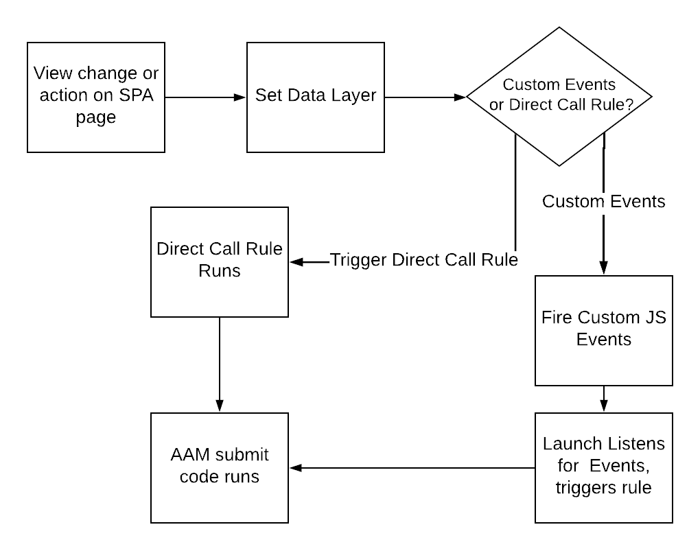

# Usar práticas recomendadas em páginas SPA ao enviar dados para AAM {#using-best-practices-on-spa-pages-when-sending-data-to-aam}

Este documento descreve várias práticas recomendadas para enviar dados de aplicativos de página única (SPA) para o Adobe Audience Manager (AAM). Este artigo se concentra em usar o [!UICONTROL Experience Platform tags], o método de implementação recomendado.

## Notas iniciais

* Os itens abaixo assumirão que você está usando tags da Platform para implementar no seu site. As considerações ainda existem se você não estiver usando tags da Platform, mas seria necessário adaptá-las ao seu método de implementação.
* Todos os SPA são diferentes, portanto, talvez seja necessário ajustar alguns dos seguintes itens para atender melhor às suas necessidades, mas o Adobe deseja compartilhar algumas práticas recomendadas que você precisa considerar ao enviar dados das páginas do SPA para o Audience Manager.

## Diagrama simples do trabalho com SPA e AAM em tags Experience Platform (antigo Launch){#simple-diagram-of-working-with-spas-and-aam-in-experience-platform-launch}

>[!NOTE]
>Como dito, este é um diagrama simplificado de como as páginas do SPA são tratadas em uma implementação do Adobe Audience Manager (sem o Adobe Analytics) usando tags da Platform. Como você pode ver, é relativamente simples, com a grande decisão sendo como você comunicará uma alteração de exibição (ou uma ação) às tags da Platform.

## Acionamento de tags na página SPA {#triggering-launch-from-the-spa-page}

Dois dos métodos mais comuns para acionar uma regra nas tags da Platform (e, portanto, enviar dados para o Audience Manager) são:

* Configuração de eventos personalizados JavaScript (consulte o exemplo [AQUI](https://helpx.adobe.com/analytics/kt/using/spa-analytics-best-practices-feature-video-use.html) com Adobe Analytics)
* Uso de um [!UICONTROL Direct Call Rule]

Neste exemplo de Audience Manager, você usa um [!UICONTROL Direct Call rule] nas tags da Platform para acionar a ocorrência que entra no Audience Manager. Como você verá nas próximas seções, isso se torna útil ao configurar o [!UICONTROL Data Layer] para um novo valor, para que ele possa ser obtido pelo [!UICONTROL Data Element] nas tags da Platform.

## Página de demonstração {#demo-page}

Esta é uma pequena página que demonstra como alterar um valor na camada de dados e enviá-lo para o Audience Manager, como pode ser feito em uma página SPA. Essa funcionalidade pode ser modelada para alterações mais elaboradas necessárias. Você pode encontrar esta página de demonstração [AQUI](https://aam.enablementadobe.com/SPA-Launch.html).

## Configuração da camada de dados {#setting-the-data-layer}

Como mencionado, quando o novo conteúdo é carregado na página ou quando alguém executa uma ação no site, a camada de dados precisa ser definida dinamicamente no cabeçalho da página ANTES que as tags da Platform sejam chamadas e executem o [!UICONTROL rules], para que as tags da Platform possam coletar os novos valores da camada de dados e enviá-los para o Audience Manager.

Se você for para o site de demonstração listado acima e observar a fonte da página, verá:

* A camada de dados está no cabeçalho da página, antes da chamada para as tags da Platform
* O JavaScript no link SPA simulado altera o [!UICONTROL Data Layer], em seguida, chama as tags da Platform (a variável `_satellite.track()` chamada de ). Se você estava usando eventos personalizados JavaScript em vez disso [!UICONTROL Direct Call Rule], a lição é a mesma. Primeiro altere o [!DNL data layer]e, em seguida, chame as tags da Platform.

>[!VIDEO](https://video.tv.adobe.com/v/23322/?quality=12)

## Recursos adicionais {#additional-resources}

* [Discussão sobre SPA nos fóruns de Adobe](https://forums.adobe.com/thread/2451022)
* [Sites de arquitetura de referência para mostrar como implementar o SPA em tags da Platform](https://helpx.adobe.com/experience-manager/kt/integration/using/launch-reference-architecture-SPA-tutorial-implement.html)
* [Utilização de práticas recomendadas ao rastrear o SPA no Adobe Analytics](https://helpx.adobe.com/analytics/kt/using/spa-analytics-best-practices-feature-video-use.html)
* [Site de demonstração usado para este artigo](https://aam.enablementadobe.com/SPA-Launch.html)
